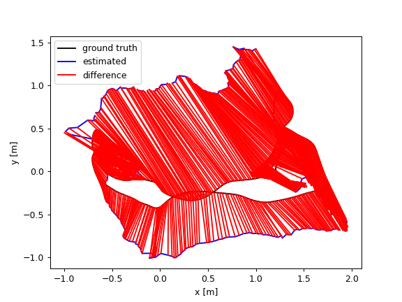
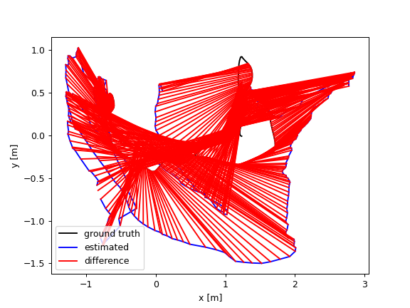

# vSLAM-py
A lightweight implementation of real-time Visual SLAM system in Python. Contains both monocular and stereo implementations. Continued from the abandoned [vSLAM](https://github.com/Gongsta/vSLAM) implementation in C++ (too tedious to write in, abandoned after writing the frontend).

Uses the following libraries (installed through `pip`):
- NumPy (for basic linear algebra)
- OpenCV (for feature detection / matching)
- g2o-python (for pose-graph optimization)
- Pangolin (for real-time visualization)
    - Note: Pangolin is not available on PyPI, though I'm [pushing for it](https://github.com/stevenlovegrove/Pangolin/issues/925)
- Matplotlib (for basic plotting, to remove)


Sources of inspiration:
- [pyslam](https://github.com/luigifreda/pyslam/tree/master)
- [twitchslam](https://github.com/geohot/twitchslam/blob/master/slam.py)
- https://github.com/niconielsen32/ComputerVision


## Installation
Getting started is super straightforward.

(Recommended, but not required) Create a virtual environment with Conda to not pollute your Python workspace:
```
conda create -n vslam-py python=3.8
```

Then, install the python libraries
```
pip install -r requirements.txt
```

## Usage

Run the monocular camera visual odometry:
```
python3 main_mono_camera.py
```

Run the stereo camera:
```
python3 main_stereo_camera.py
```

## Discussions

### Why Python
Python is very much more flexible than C++. It's a lot easier to debug a Python system. It would have taken me a lot longer to write this in C++.

Python will never beat C++ performanace due to its interpreted nature. However, all libraries I use are written in C++ under the hood (OpenCV, g2o, Pangolin), so the performance hit is minimal. Python is merely a high-level interface to these libraries.

### Monocular vs. Stereo Visual SLAM

Mono and stereo visual odometry share many of the same techniques.
Only difference with Mono is that ground-truth depth can be obtained directly (unless you run deep monocular depth estimation, or use a RGB-D camera).

However, monocular SLAM is more accessible, and everyone can just try it on their computers using a webcam. Stereo cameras aren't as standardized.


### Timeline
03-20-2024: Initial commit for python. Project started in C++, but I transitioned to Python for ease of development.
04-29-2024: Add working frontend for visual odometry.
05-12-204: Add bundle adjustment.
05-21-2024: Add benchmarking to track improvements in data (finally...).

### Benchmark
The goal is to incrementally improve this SLAM system, while minimizing complexity, and guaranteeing real-time performance.

I will be benchmarking against the [fr1/desk]() dataset.


2024-05-22: Realized that I had my transforms inverted... slightly better results!


Before
```python
self.relative_poses.append(T)
self.poses.append(self.relative_poses[-1] @ self.poses[-1])
```

After

```python
T = np.linalg.inv(T)
self.relative_poses.append(T)
self.poses.append(self.poses[-1] @ self.relative_poses[-1])
```

```
compared_pose_pairs 570 pairs
absolute_translational_error.rmse 0.918237 m
absolute_translational_error.mean 0.829502 m
absolute_translational_error.median 0.752555 m
absolute_translational_error.std 0.393810 m
absolute_translational_error.min 0.217567 m
absolute_translational_error.max 1.714041 m
```




2024-05-21: Added the dataset. Initial results. Ew...



```
compared_pose_pairs 570 pairs
absolute_translational_error.rmse 0.953799 m
absolute_translational_error.mean 0.892556 m
absolute_translational_error.median 0.849063 m
absolute_translational_error.std 0.336267 m
absolute_translational_error.min 0.216631 m
absolute_translational_error.max 1.840347 m
```
