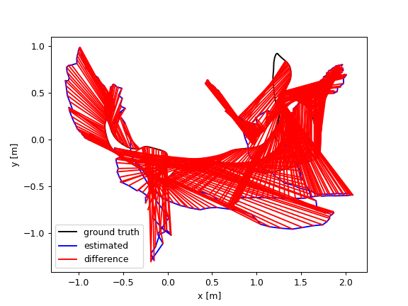

# vSLAM-py (WORK-IN-PROGRESS)
A lightweight implementation of real-time Visual SLAM system in Python. Contains both monocular and stereo implementations. Continued from the abandoned [vSLAM](https://github.com/Gongsta/vSLAM) implementation in C++, which was too tedious to debug, and abandoned after writing basic visual odometry code.

Uses the following libraries (installed through `pip`):
- OpenCV (for feature detection / matching)
- g2o-python (for graph optimization)
- Pangolin (for real-time visualization)
    - Note: Pangolin is not available on PyPI, though I'm [pushing for it](https://github.com/stevenlovegrove/Pangolin/issues/925)

Sources of inspiration:
- [slambook-en](https://github.com/gaoxiang12/slambook-en/blob/master/slambook-en.pdf) (BEST textbook to learn visual SLAM)
- [pyslam](https://github.com/luigifreda/pyslam/tree/master)
- [twitchslam](https://github.com/geohot/twitchslam/blob/master/slam.py)
- ORB-SLAM1, ORB-SLAM2, and DSO papers
- https://github.com/niconielsen32/ComputerVision

Currently sitting at ~0.14m translation error on the TUM-RGBD dataset (more info below). 

ORB Feature matching with outlier filtering


https://github.com/Gongsta/vSLAM-py/assets/43485866/7ac61970-2fe6-49ab-87ab-c60c1bffcb5d


Estimated pose (green is ground truth pose, red is estimated pose)


https://github.com/Gongsta/vSLAM-py/assets/43485866/3dedd824-2fb5-40e5-9052-7f81aa0a1e1e


## Installation
Getting started is super straightforward.

(*Recommended, but not required*) Create a virtual environment with Conda to not pollute your Python workspace:
```
conda create -n vslam-py python=3.8
```

Then, install the Python libraries
```
pip install -r requirements.txt
```

Note that you will have to install pyPangolin yourself at the moment.

## Usage

Run the monocular camera visual odometry, which uses epipolar geometry to estimate the camera pose:
```
python3 main_mono_camera.py
```

Run the stereo camera:
```
python3 main_stereo_camera.py
```

Run on the TUM dataset if you don't have a camera:
```python
python3 main_tum.py
```

## Important assumptions with your own cameras
Timestamps should be filled in correctly (default is incrementing by 0.1s). This is important for the optimization to work correctly.

For depth cameras
- Unknown depth values are expected to be populated with `np.NaN` (not 0). This is important for the optimization to work correctly

## Terminology
- Feature: A point in the image that can be tracked over time
- Landmarks / Map points: 3D points in the world of features that are detected by the camera

## Discussions

### Why Python
Python is much more flexible than C++, and easier to set up. Trying this stuff should be as easy as running 2-3 commands in the terminal. If it was written in C++, you'd need to install dependencies, compile the code, and then run it. In Python, you simply need to `pip` install the requirements, and you are good to go. Also, I find it a lot easier to debug a Python system (at this minimum codebase scale). In C++, I'd need something like `gdb`.

Of course, Python will never beat C++ performance due to its interpreted nature. However, all libraries I use are written in C++ under the hood (OpenCV, g2o, Pangolin), so the performance hit is minimal. Python is merely a high-level interface to these libraries.

Overall, it would have taken me a lot longer to write this in C++, and much less people would want to try it out.
### Monocular vs. Stereo Visual SLAM

Mono and stereo visual odometry share many of the same techniques.
Only difference with Mono is that ground-truth depth can be obtained directly (unless you run deep monocular depth estimation, or use a RGB-D camera).

However, monocular SLAM is more accessible, and everyone can just try it on their computers using a webcam. Stereo cameras aren't as standardized.


### Timeline
03-20-2024: Initial commit for python. Project started in C++, but I transitioned to Python for ease of development.

04-29-2024: Add working frontend for visual odometry.

05-12-204: Add bundle adjustment.

05-21-2024: Add benchmarking with TUM-RGBD dataset to track improvements in data (finally...).

### Benchmarking
The goal is to incrementally improve this SLAM system, while minimizing complexity, and guaranteeing real-time performance.

I will be benchmarking against the [fr1/desk]() dataset.


2024-05-24 to 2024-05-28: Trying to use keyframes and local mapping, based on ideas from PTAM and ORB-SLAM. God this isn't that hard theoretically, but painfully tedious to implement.

Use dbow, a bag of words library with pretrained images from the TUM dataset. This will be used to match the current frame to the keyframes. If the current frame is not matched to any keyframes, it will be added as a new keyframe.

This doesn't work well...sunk cost fallacy. I think I should stop here. I should have stopped at 14cm RMSE.


2024-05-23:  I was not strict with filtering bad matches between frames. Trying a few configurations, and `cv2.findHomography` to filter out outliers. Thanks Kj! Found best one to be 0.7 lowe's ratio threshold and cv2.findHomography to filter out outliers.
improvement to **~0.14m** RMSE!

Filtering out the matches, taking only the top matches also helps a lot with computation time. I am taking **no filtering, 0.7 lowe's ratio threshold, and cv2.findHomography outlier rejection** as the best configuration.

Some results below (*note: measurements are flaky, sometimes I get better results with more matches, sometimes with less*):

No filtering, no cv2.findHomography:
- 0.8 lowe's ratio threshold - 0.918237 m RMSE
- 0.7 lowe's ratio threshold - 0.161828 m RMSE
- 0.5 lowe's ratio threshold - 0.160740 m RMSE

We can see that being strict with bad matches really helps. Huge jump from 0.8 to 0.7 threshold.

0.7 lowe's ratio threshold, with cv2.findHomography outlier rejection:
- top 100 matches - 0.290785 m RMSE
- top 200 matches - 0.222357 m RMSE
- top 400 matches - 0.172895 m RMSE
- top 800 matches - 0.149658 m RMSE
- top 1000 matches - 0.143917 m RMSE
- top 1600 matches - 0.137692 m RMSE
- No filtering top matches - **0.139491** m m RMSE

In general, the less we filter the better the results. This seems consisten with the paper [Real-time monocular SLAM: Why filter?](https://ieeexplore.ieee.org/document/5509636).


```
compared_pose_pairs 570 pairs
absolute_translational_error.rmse 0.142910 m
absolute_translational_error.mean 0.139057 m
absolute_translational_error.median 0.137050 m
absolute_translational_error.std 0.032960 m
absolute_translational_error.min 0.067943 m
absolute_translational_error.max 0.214920 m
```


2024-05-22: Realized that I had my transforms inverted... slightly better results!

Before
```python
self.relative_poses.append(T)
self.poses.append(self.relative_poses[-1] @ self.poses[-1])
```

After

```python
T = np.linalg.inv(T)
self.relative_poses.append(T)
self.poses.append(self.poses[-1] @ self.relative_poses[-1])
```

```
compared_pose_pairs 570 pairs
absolute_translational_error.rmse 0.918237 m
absolute_translational_error.mean 0.829502 m
absolute_translational_error.median 0.752555 m
absolute_translational_error.std 0.393810 m
absolute_translational_error.min 0.217567 m
absolute_translational_error.max 1.714041 m
```


2024-05-21: Added the dataset. Initial results. Ew...



```
compared_pose_pairs 570 pairs
absolute_translational_error.rmse 0.953799 m
absolute_translational_error.mean 0.892556 m
absolute_translational_error.median 0.849063 m
absolute_translational_error.std 0.336267 m
absolute_translational_error.min 0.216631 m
absolute_translational_error.max 1.840347 m
```
